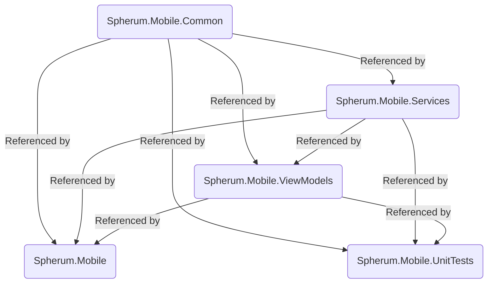

# Spherum.Mobile.App

A .NET MAUI Cross Platform application written in C#.

- Targeting Android 7.0 (API 24) and above.
- Targeting iOS 13 and above.

This application is an assignment given by `Spherum` and provides student management functionality for `Spherum`.

## Solution Structure

